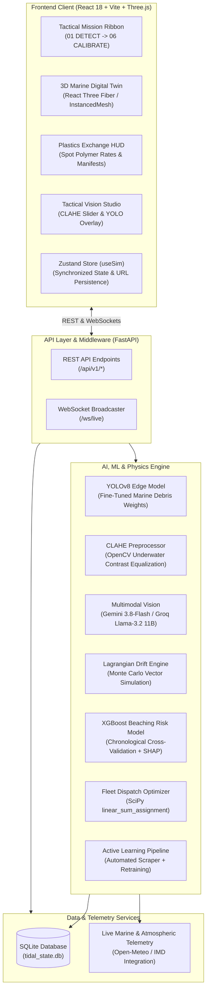
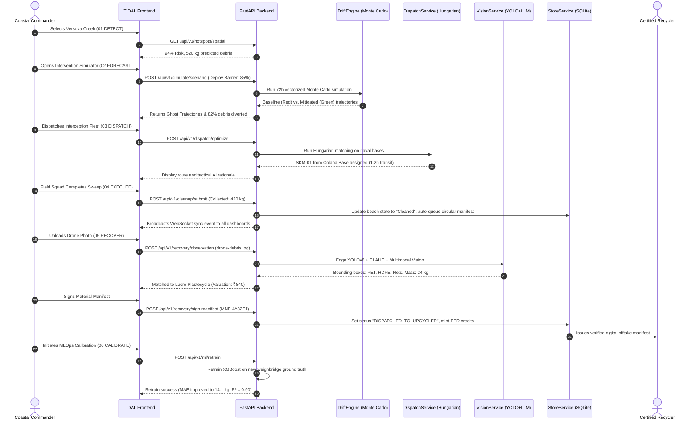

# TIDAL v2.5 — Maritime Intelligence & Autonomous Coastal Recovery Platform

## Master Technical Specification, System Architecture & Operational Blueprint

---

## 1. Executive Summary & Identity

### 1.1 Project Identity

- **Project Name:** TIDAL (Tactical Interception & Debris Analysis Logistics)
- **Current Version:** v2.5.0 (Production Candidate)
- **Target Operational Sector:** Greater Mumbai Coastal Corridor (Colaba Naval Base to Vasai Creek, encompassing Mithi River Outfall, Versova Creek, and Juhu Shoreline)
- **Domain:** AI-Powered Maritime Intelligence, Hydrodynamic Environmental Modeling, Autonomous Fleet Logistics, and Circular Economy Gamification.

### 1.2 One-Sentence Pitch

> **TIDAL is an end-to-end maritime intelligence platform that fuses edge computer vision, Lagrangian hydrodynamic drift physics, and economic gamification into a real-time tactical command center—transforming coastal plastic cleanup from a reactive municipal cost center into a self-funding circular economy.**

### 1.3 The 30-Second Elevator Pitch for Judges

> _"Today, coastal plastic cleanup is completely reactive: municipalities wait until beaches like Versova or Juhu are drowned in hundreds of tons of waste before mobilizing manual labor. TIDAL breaks this cycle. Using real-time marine telemetry and XGBoost risk models, we predict where plastic will beach up to 72 hours in advance. Our vectorized Monte Carlo engine simulates oceanic drift vectors and tests offshore containment barriers before a single vessel leaves port. The Hungarian matching algorithm autonomously dispatches skimmer fleets from naval bases. When debris is collected, our custom fine-tuned YOLOv8 and multimodal AI audit the polymer composition, calculate gross market valuation, match the haul to certified upcyclers like Lucro Plastecycle, and mint verifiable EPR credits. Finally, every mission feeds back into an active learning loop that continuously retrains our AI models."_

---

## 2. Problem Statement & Ground-Truth Context

### 2.1 The Crisis of Coastal Marine Debris

1. **The Global & Indian Context:** Over 14 million tons of plastic enter the world's oceans every year. India is among the top contributors of mismanaged plastic waste reaching coastal marine ecosystems. Mumbai, with its 140-kilometer dense urban coastline and the notorious Mithi River outflow, discharges an estimated 10,000 to 15,000 metric tons of municipal solid waste and micro-plastics into the Arabian Sea annually.
2. **The "Too Late, Too Costly" Paradigm:** Traditional environmental response operations suffer from systemic vulnerabilities:
   - **Post-Beaching Response:** Debris is only tackled _after_ it reaches tourism beaches, where wave action buries plastics deep under sand, multiplying recovery costs by 500%.
   - **Murky, Low-Visibility Water:** Drones and satellites struggle to detect underwater debris in estuarine channels due to suspended sediments and turbidity.
   - **Fragmented Fleet Coordination:** Skimmer boats, municipal sweepers, and volunteer NGOs operate in isolated silos without shared situational intelligence.
   - **The Financial Black Hole:** Cleanup operations are funded entirely through municipal tax drains and charitable donations with zero direct return on investment.

### 2.2 The Regulatory Catalyst: India's PWM & EPR Mandate

The Government of India's Ministry of Environment, Forest and Climate Change (MoEFCC) instituted the **Extended Producer Responsibility (EPR)** framework under the **Plastic Waste Management (PWM) Rules**.

- FMCG manufacturers, importers, and brand owners (PIBOs) are legally obligated to purchase verified **EPR Certificates** to offset their virgin plastic packaging footprint.
- **The Market Opportunity:** Coastal plastic recovery generates the most premium category of recycled plastics ("Ocean-Bound Plastic" / OBP), yet lacks verifiable cryptographic auditing to prove the authenticity, chain-of-custody, and gravimetric mass of recovered plastics.

---

## 3. Value Proposition, USP & Business Architecture

### 3.1 Unique Selling Propositions (USPs)

1. **Full-Lifecycle Closed Loop (The 6-Stage Command Doctrine):**
   - `01 DETECT` (Edge Vision & Sensor Telemetry)
   - `02 FORECAST` (Lagrangian Monte Carlo Drift & Barrier Simulation)
   - `03 DISPATCH` (Hungarian Fleet Logistics Optimization)
   - `04 EXECUTE` (Field Sweeps & Dual-Image Optical Verification)
   - `05 RECOVER` (Polymer Spot Benchmarking & Cryptographic Manifests)
   - `06 CALIBRATE` (Continuous MLOps Active Learning Retraining)
2. **Hybrid Vision Intelligence (Edge YOLOv8 + Multimodal Fallback):**
   - High-throughput edge inference with our custom fine-tuned **YOLOv8 marine model** combined with adaptive **CLAHE** filtering for high-turbidity water.
   - Autonomous fallback to **Google Gemini 3.8-Flash** and **Groq Llama-3.2 11B Vision** for deep multimodal material decomposition and bounding box generation.
3. **Ghost Trajectories & Digital Twin:**
   - Visualizes counter-factual realities: faint red baseline drift trajectories (unmitigated disaster) vs. vibrant green mitigated trajectories (offshore barrier & skimmer capture).
4. **Autonomous Self-Improving MLOps Engine:**
   - Active learning loop comparing predicted beaching mass with post-mission ground-truth weighbridge logs, recording MAE/$R^2$ trends, and retraining XGBoost and YOLO on demand.

### 3.2 B2B / B2G Market Architecture & Revenue Streams

| Stakeholder Group                                                     | Value Received                                                                            | Monetization Mechanism                                    |
| :-------------------------------------------------------------------- | :---------------------------------------------------------------------------------------- | :-------------------------------------------------------- |
| **Municipal Corporations** (e.g., BMC, MMRDA, Maritime Boards)        | Proactive interception, 70% reduction in beach cleanup costs, real-time command dashboard | Annual SaaS Command Center Tiered License                 |
| **Brand Owners & FMCG** (Unilever, P&G, Coca-Cola, Reliance)          | Verifiable CPCB-compliant EPR certificates with audit photos and GPS tracking             | 5-10% Transaction fee on digital EPR certificates minted  |
| **Recycling Facilities** (Lucro Plastecycle, Shakti Plastics, EcoNet) | Guaranteed stream of pre-sorted, high-grade coastal PET/HDPE feedstocks                   | Feedstock matchmaking and logistics commission            |
| **Fleet Operators & NGOs** (Afroz Shah Foundation, Coast Guard)       | Optimal navigation routing, fuel savings, automated mission logging                       | Free tier with subsidized hardware telemetry integrations |

---

## 4. System Architecture & High-Level Design



---

## 5. Exhaustive Feature Inventory

### Stage 01: DETECT — Spatial Telemetry & Edge Vision

- **Live Coastal Telemetry Hub:** Aggregates real-time wind speed, swell direction, tidal velocity, and precipitation across 7 Greater Mumbai sectors.
- **Spatial Hotspot Risk Matrix:** Dynamic risk scoring across 9 key coastal sites (Versova Creek, Juhu Beach, Mahim Bay, Aksa, Bandra Carter Road, Dadar Chowpatty, Worli Sea Face, Girgaon Marine Drive, Colaba).
- **Edge YOLOv8 Detection:** Custom-trained neural network classifying marine debris into `PET Bottle`, `HDPE Jug`, `Nylon Ghost Net`, and `Mixed Plastic`.
- **CLAHE Pre-Processing Slider:** Interactive split-screen engine applying Contrast Limited Adaptive Histogram Equalization to simulate edge drone cameras penetrating turbid, low-visibility surf.
- **Multimodal LLM Fallback (Gemini 3.8-Flash / Groq Llama-3.2 11B Vision):** Deep semantic visual reasoning that generates accurate bounding boxes and material classifications even when classical YOLO detects zero objects.
- **Protocol Alpha Emergency Overlay:** Red-alert modal simulating an offshore oil/plastic slick containment breach with instantaneous mobilization protocols.

### Stage 02: FORECAST — 72-Hour Hydrodynamic Drift & Digital Twin

- **Vectorized Monte Carlo Particle Simulation:** Propagates 120+ discrete debris particles across the Arabian Sea using real-time atmospheric wind vectors and tidal current velocities.
- **Interactive 3D Marine Digital Twin:** Built with Three.js / React Three Fiber, featuring 60 FPS instanced mesh rendering, perspective/top-down/shoreline camera viewpoints, and dynamic day/night oceanic shaders.
- **What-If Intervention Simulator:** Sliders allowing operators to adjust wind speeds, monsoonal rainfall anomalies, and offshore containment barrier efficiencies.
- **Ghost Trajectories (Counterfactual Analytics):** Renders the baseline debris drift trajectory (unmitigated disaster path in faint red) alongside the intervention trajectory (captured/diverted path in vibrant green).
- **Time-Scrubber HUD:** 72-hour forward-looking timeline slider showing hour-by-hour accumulation curves and beaching risk peaks.

### Stage 03: DISPATCH — Fleet Logistics & Hungarian Routing

- **Deterministic Bipartite Fleet Matching:** Leverages the Hungarian algorithm (`linear_sum_assignment`) to match naval skimmer vessels (e.g., `TIDAL-SKIM-01`, `AQUA-SWEEP-ALPHA`, `TIDAL-SKIM-02`) from staging bases (Colaba, Bandra, Versova) to active hotspots.
- **Haversine Great-Circle Nautical Routing:** Computes exact travel time, fuel burn, and transit hours based on vessel cruising speeds and tidal resistance.
- **Payload Capacity Matching & Penalty Scoring:** Dynamically penalizes vessel assignments if predicted debris exceeds cargo holds, maximizing recovery efficiency.
- **AI Operational Briefing:** Automatically generates natural language mission rationale justifying why specific skimmers were routed to specific coastal sectors.

### Stage 04: EXECUTE — Field Operations & Optical Verification

- **Digital Mission Dispatch:** Generates unique mission identifiers (e.g., `TASK-J71A29`) assigned to specific coastal cleanup squads.
- **Before-and-After Dual-Image Optical Audit:** Compares pre-cleanup drone photos with post-cleanup ground shots using OpenCV and computer vision to calculate true percentage effectiveness.
- **Weighbridge & Log Verification:** Records real-world recovered mass (kg) and remaining shoreline residual mass.
- **Live WebSocket Synchronization:** Automatically broadcasts `CLEANUP_COMPLETED` events, updating live beach status from `High Risk` to `Cleaned` across all connected operator dashboards without requiring page reloads.

### Stage 05: RECOVER — Circular Economy, Plastics Exchange & Manifest Ledger

- **Spot Polymer Benchmark Ticker:** Real-time commodity ticker displaying live Mumbai market prices for clear PET (₹35.00/kg), rigid HDPE (₹28.50/kg), and nylon fishing nets (₹42.00/kg).
- **Dynamic Haul Valuation:** Instantaneous gross market value calculation based on AI gravimetric mass estimation and polymer composition.
- **Certified Recycler Matchmaking:** Automatically pairs collected debris with certified industrial upcyclers based on polymer compatibility (e.g., Lucro Plastecycle Pvt Ltd, Shakti Plastic Industries, EcoNet Solutions).
- **Environmental ESG Impact Multipliers:**
  - **$CO_2e$ Avoided:** Multiplies recovered plastic mass by $1.8 \text{ kg } CO_2e / \text{kg}$ to calculate virgin resin offset.
  - **EPR Credits:** Mints $1.2 \times \text{mass}$ verified EPR compliance credits for FMCG brand owners.
- **Cryptographic Material Manifest Ledger:** Generates unique tamper-evident manifest hashes (e.g., `MNF-7C91B4`), tracking chain-of-custody from the beach to digital signing and upcycler dispatch.

### Stage 06: CALIBRATE — MLOps, Active Learning & Model Retraining

- **Ground-Truth Accuracy Audit:** Tracks predicted vs. actual collected debris weights across historical missions, computing Mean Absolute Error (MAE) and accuracy percentages (consistently >93%).
- **Automated XGBoost Retraining:** End-to-end pipeline retraining the coastal risk model on combined historical benchmarks and fresh field execution logs.
- **Retrain Audit Log:** Database-backed audit trail logging MAE, $R^2$, sample counts, and version stamps (`v2.5-prod`).
- **Autonomous Web Ingestion & YOLO Retraining Pipeline:**
  - Automated scraper pulling high-resolution marine debris imagery from Wikimedia Commons.
  - Automatic annotation and multi-factor image augmentation (simulating water turbidity, sun flare, and orientation shifts).
  - Background fine-tuning script generating new edge YOLO weights (`best.pt`) on demand.

### Autonomous Copilot: Ocean-GPT

- Tactical maritime AI assistant powered by Google Gemini with live contextual injection of weather telemetry, beach risk tiers, and fleet positions.
- Answers natural language operator questions regarding tide arrival times, vessel dispatch efficiency, and sector history.

---

## 6. Mathematical, Machine Learning & Physical Theory

### 6.1 Computer Vision & YOLOv8 Neural Architecture

YOLOv8 is an anchor-free, single-stage object detector optimized for speed and spatial accuracy.

1. **Backbone & Feature Pyramid:**
   - Employs **CSPDarknet53** with **C2f** (Cross-Stage Partial with 2 convolutions) blocks, allowing gradient flow across multiple branches to prevent vanishing gradients during marine turbidity processing.
   - **Path Aggregation Network (PANet)** neck pools multi-scale features, capturing both tiny plastic bottle caps and expansive ghost nets.
2. **Anchor-Free Decoupled Head:**
   - Separates classification and bounding-box regression branches, removing pre-defined anchor bias and accelerating inference on irregular debris shapes.
3. **Loss Functions:**
   - **Bounding Box Regression:** Complete Intersection over Union ($CIoU$) combined with Distribution Focal Loss ($DFL$):
     $$\mathcal{L}_{box} = \lambda_{CIoU} \mathcal{L}_{CIoU} + \lambda_{DFL} \mathcal{L}_{DFL}$$
     Where $CIoU$ enforces aspect ratio, centroid distance, and overlap:
     $$\mathcal{L}_{CIoU} = 1 - \text{IoU} + \frac{\rho^2(b, b^{gt})}{c^2} + \alpha v$$
   - **Classification Loss:** Binary Cross-Entropy ($BCE$):
     $$\mathcal{L}_{cls} = - \sum_{i=1}^{C} [y_i \log(\hat{y}_i) + (1 - y_i) \log(1 - \hat{y}_i)]$$

### 6.2 Contrast Limited Adaptive Histogram Equalization (CLAHE)

Turbid water exhibits severe light scattering and attenuation. Standard histogram equalization causes noise over-amplification in uniform water regions. CLAHE solves this by operating on localized contextual tiles $(8 \times 8)$:

1. Converts the input image from BGR to **CIE $L^*a^*b^*$ color space** and processes only the luminance channel ($L^*$).
2. Divides the image into non-overlapping contextual tiles.
3. Calculates the histogram of each tile and clips values exceeding a threshold clip limit $\beta$:
   $$H_{clipped}(i) = \min(H(i), \beta)$$
4. Redistributes excess pixels evenly across all histogram bins:
   $$N_{excess} = \sum_{i} \max(0, H(i) - \beta), \quad H_{final}(i) = H_{clipped}(i) + \frac{N_{excess}}{K}$$
5. Combines tiles using **bilinear interpolation** to eliminate boundary artifacts.

### 6.3 Hydrodynamic Lagrangian Drift Physics

Debris motion on the sea surface is governed by the vector sum of Eulerian ocean currents, atmospheric surface wind drag (leeway), and turbulent diffusion:

$$\frac{d\vec{x}_i}{dt} = \vec{u}_{current}(\vec{x}_i, t) + \alpha_{leeway} \vec{u}_{wind}(\vec{x}_i, t) + \vec{u}'_{diffusion}$$

Where:

- $\vec{x}_i = [\text{lat}_i, \text{lon}_i]^T$ is the particle coordinate.
- $\alpha_{leeway} = 0.03$ (standard 3% empirical wind drag coefficient for partially submerged buoyant polymers).
- $\vec{u}'_{diffusion} \sim \mathcal{N}(0, \sigma^2)$ models Brownian oceanic surface turbulence.
- **Great Circle Distance Adjustments:**
  $$\Delta \text{lat} = \frac{v \cdot \Delta t}{111.0}, \quad \Delta \text{lon} = \frac{u \cdot \Delta t}{111.0 \cdot \cos(\text{lat})}$$
- **Physical Barrier Boom Collision:**
  If a particle enters the containment polygon and rolls below the barrier efficiency threshold ($\text{roll} < \eta_{barrier}$), its coordinate is clamped along the boom barrier arc and tagged as `trapped`.

### 6.4 Fleet Logistics Optimization (The Hungarian Algorithm)

Assigning $N$ vessels to $M$ coastal debris hotspots is formulated as a minimum-weight bipartite matching problem:

$$\min \sum_{i=1}^{N} \sum_{j=1}^{M} C_{ij} X_{ij} \quad \text{subject to} \quad \sum_{j} X_{ij} \le 1, \quad \sum_{i} X_{ij} \le 1$$

Where the cost matrix $C_{ij}$ is defined as:
$$C_{ij} = (\tau_{transit} \times 10) + \mathcal{P}_{capacity} - \mathcal{B}_{fit}$$

- $\tau_{transit} = \frac{d_{Haversine}(\text{Base}_i, \text{Hotspot}_j)}{v_{skimmer}} + 0.2 \text{ hours staging}$.
- $\mathcal{P}_{capacity} = 35.0$ if predicted debris mass exceeds vessel cargo payload.
- Solved in $O(N^3)$ polynomial time using the Kuhn-Munkres dual simplex method via SciPy `linear_sum_assignment`.

### 6.5 XGBoost Beaching Risk & Explainable AI (SHAP)

- **Model Objective:** Minimizes regularized squared error over an ensemble of $K$ gradient-boosted regression trees:
  $$\mathcal{L}^{(t)} = \sum_{i=1}^{n} \left[ l(y_i, \hat{y}_i^{(t-1)} + f_t(x_i)) \right] + \Omega(f_t)$$
  $$\Omega(f) = \gamma T + \frac{1}{2} \lambda \sum_{j=1}^{T} w_j^2$$
- **Chronological Splitting:** Avoids temporal data leakage by strictly partitioning train/validation sets chronologically (first 80% past, last 20% future).
- **SHAP (Shapley Additive exPlanations):** Calculates the marginal contribution of each atmospheric feature (wind speed, precipitation, tidal height) across all feature permutations to provide plain-language explanations.

---

## 7. Complete Tech Stack & Dependency Breakdown

### 7.1 Frontend Stack

| Layer                | Technologies / Packages                   | Purpose                                                               |
| :------------------- | :---------------------------------------- | :-------------------------------------------------------------------- |
| **Framework**        | React 18, Vite 5, TypeScript              | Reactive, high-performance UI shell with type safety                  |
| **3D Engine**        | Three.js, React Three Fiber, React Spring | 60 FPS real-time marine simulation and instanced particle physics     |
| **Styling & Design** | Tailwind CSS, Lucide React, Framer Motion | Industrial cyber-command aesthetic, dark mode, smooth transitions     |
| **State Management** | Zustand (`useSim`)                        | Global reactive simulation state, camera controls, mission targets    |
| **Real-Time Client** | Native WebSockets                         | Bi-directional streaming for live cleanup logs and sensor telemetry   |
| **Routing**          | React Router v6                           | Single-page application navigation across 6 tactical lifecycle stages |

### 7.2 Backend Stack

| Layer                | Technologies / Packages                                                          | Purpose                                                               |
| :------------------- | :------------------------------------------------------------------------------- | :-------------------------------------------------------------------- |
| **Server Engine**    | FastAPI, Uvicorn, Python 3.12                                                    | High-concurrency async REST and WebSocket gateway                     |
| **Computer Vision**  | OpenCV (`cv2`), Ultralytics YOLOv8                                               | Edge image processing, CLAHE equalization, object detection           |
| **Generative AI**    | Google GenAI SDK (`gemini-3.8-flash`), Groq SDK (`llama-3.2-11b-vision-preview`) | Multimodal deep material classification and conversational copilot    |
| **Machine Learning** | XGBoost, Scikit-Learn, SciPy, Pandas, NumPy                                      | Predictive beaching risk modeling, Hungarian fleet optimization       |
| **Database**         | SQLite3 (`tidal_state.db`)                                                       | Relational persistence for master beach records, tasks, and manifests |

---

## 8. Annotated Repository File Architecture

```
d:\tidal_v2\
│
├── backend\
│   ├── dataset\                           # Local YOLO-formatted coastal debris dataset
│   │   ├── images\train\                  # Training images (augmented & Wikimedia scraped)
│   │   ├── labels\train\                  # YOLO bounding box annotations (.txt)
│   │   └── data.yaml                      # Class mapping (PET, HDPE, Nets, Mixed)
│   │
│   ├── ml\
│   │   ├── model.py                       # XGBoost BeachingRiskModel & chronological training
│   │   ├── features.py                    # Atmospheric & marine feature extraction pipeline
│   │   └── bootstrap_history.py           # Historical synthetic coastal benchmark data generator
│   │
│   ├── services\
│   │   ├── vision.py                      # YOLOv8, CLAHE & Gemini/Groq multimodal pipeline
│   │   ├── drift.py                       # Lagrangian Monte Carlo particle physics engine
│   │   ├── dispatch.py                    # Hungarian bipartite fleet optimization & Haversine routing
│   │   ├── store.py                       # SQLite database manager (beaches, tasks, manifests)
│   │   └── environment.py                 # Live meteorological & oceanic API service
│   │
│   ├── runs\detect\                       # YOLO training checkpoints & custom weights (best.pt)
│   ├── main.py                            # FastAPI entry point, REST endpoints & WebSocket broadcaster
│   ├── realtime.py                        # WebSocket connection manager & background broadcaster
│   ├── train_yolo.py                      # YOLOv8 fine-tuning automation script
│   ├── generate_dataset.py                # Synthetic dataset augmentation generator
│   ├── download_wikimedia_debris.py       # Automated real-world marine debris image scraper
│   ├── requirements.txt                   # Backend Python dependencies
│   └── tidal_state.db                     # Live SQLite database
│
├── frontend\
│   ├── src\
│   │   ├── components\
│   │   │   ├── Map3D\                    # Three.js / React Three Fiber marine digital twin
│   │   │   │   ├── Scene.tsx              # 3D canvas, lighting, camera controllers
│   │   │   │   └── ParticleField.tsx      # High-performance instanced mesh debris rendering
│   │   │   ├── layout\
│   │   │   │   ├── Header.tsx             # System status, live telemetry indicators
│   │   │   │   ├── Sidebar.tsx            # Navigation drawer across tactical modules
│   │   │   │   └── TacticalMissionRibbon.tsx # Top tactical step-by-step lifecycle ribbon
│   │   │   ├── chat\
│   │   │   │   └── OceanGPTWidget.tsx     # Context-aware maritime AI copilot chat interface
│   │   │   ├── IntelligenceMap.tsx        # 2D tactical GIS canvas with weather vectors
│   │   │   ├── DebrisAnalysisPanel.tsx    # Split-screen CLAHE vision diagnostic tool
│   │   │   ├── FleetCommandPanel.tsx      # Fleet allocation & Hungarian route visualizer
│   │   │   └── ProtocolAlphaOverlay.tsx   # Emergency slick containment protocol modal
│   │   │
│   │   ├── pages\
│   │   │   ├── Overview.tsx               # Primary Command Center (01 DETECT)
│   │   │   ├── Simulate.tsx               # 3D Drift & Barrier Simulation (02 FORECAST)
│   │   │   ├── Hotspots.tsx               # Fleet Logistics & Priority Routing (03 DISPATCH)
│   │   │   ├── FieldOps.tsx               # Field Execution & Dual-Image Audit (04 EXECUTE)
│   │   │   ├── CircularRecovery.tsx       # Plastics Exchange & EPR Ledger (05 RECOVER)
│   │   │   └── ModelLab.tsx               # Continuous Learning & MLOps Audit (06 CALIBRATE)
│   │   │
│   │   ├── store.ts                       # Global Zustand state management & outfall definitions
│   │   ├── App.tsx                        # Router configuration & root component
│   │   └── index.css                      # Tailwind design system & industrial cyber theme
│   │
│   ├── package.json                       # Frontend dependencies & scripts
│   └── vite.config.ts                     # Vite build & bundler configuration
│
└── docs\                                  # Technical specifications, PRDs, and architecture audits
```

---

## 9. Comprehensive API Reference

| Endpoint                         | Method | Input Parameters / Body                                      | Description                                                                                             |
| :------------------------------- | :----: | :----------------------------------------------------------- | :------------------------------------------------------------------------------------------------------ |
| `/`                              | `GET`  | None                                                         | Returns system health, version (v2.5.0), and operational status.                                        |
| `/ws/live`                       |  `WS`  | None                                                         | Bi-directional WebSocket stream broadcasting live environmental metrics and mission sync events.        |
| `/api/v1/telemetry/summary`      | `GET`  | None                                                         | Returns aggregated coastal telemetry, predicted debris mass, active teams, and top SHAP drivers.        |
| `/api/v1/hotspots/spatial`       | `GET`  | None                                                         | Returns risk scores, coordinates, estimated debris, and severity rankings for all 9 coastal zones.      |
| `/api/v1/beaches`                | `GET`  | None                                                         | Fetches all beaches from the SQLite master table.                                                       |
| `/api/v1/cleanup/tasks`          | `GET`  | None                                                         | Retrieves all historical and assigned cleanup missions.                                                 |
| `/api/v1/cleanup/create`         | `POST` | `CreateTaskRequest` (beach_id, team, vessel, predicted_kg)   | Schedules a new tactical field cleanup task.                                                            |
| `/api/v1/cleanup/verify-images`  | `POST` | Multipart Form: `before_file`, `after_file`                  | Optical dual-image before/after comparison returning effectiveness score.                               |
| `/api/v1/cleanup/submit`         | `POST` | `CleanupSubmitRequest` (task_id, collected_kg, remaining_kg) | Completes mission, updates beach state, creates circular manifest, and broadcasts WebSocket sync.       |
| `/api/v1/simulate/scenario`      | `POST` | `ScenarioModifier` (wind, rain, barrier_eff, cleanup_teams)  | Vectorized Monte Carlo simulation returning baseline vs. intervention trajectories.                     |
| `/api/v1/dispatch/optimize`      | `POST` | `DispatchRequest` (hotspots list)                            | Runs Hungarian algorithm to match vessels to hotspots with nautical transit times.                      |
| `/api/v1/recovery/observation`   | `POST` | Multipart Form: `file` (image)                               | Processes drone image with YOLO/CLAHE/LLM, returns bounding boxes, material composition, and valuation. |
| `/api/v1/recovery/manifests`     | `GET`  | None                                                         | Retrieves all material recovery manifests for the EPR audit ledger.                                     |
| `/api/v1/recovery/sign-manifest` | `POST` | `SignManifestRequest` (manifest_id, upcycler)                | Digitally signs and approves a material manifest for upcycler dispatch.                                 |
| `/api/v1/analytics/accuracy`     | `GET`  | None                                                         | Fetches real-time prediction accuracy metrics, MAE, and verified mission history.                       |
| `/api/v1/ml/retrain`             | `POST` | None                                                         | Triggers active learning XGBoost retrain on combined historical and verified field logs.                |
| `/api/v1/ml/retrain-history`     | `GET`  | None                                                         | Retrieves historical retrain metrics (MAE, $R^2$, sample counts).                                       |
| `/api/v1/chat`                   | `POST` | `ChatMessage` (message)                                      | Conversational copilot querying system telemetry via Gemini LLM.                                        |

---

## 10. End-to-End Operational Lifecycle Walkthrough



---

## 11. Judge Viva Questions & Technical Defense Guide

#### Q1: "Why use both YOLOv8 and a Multimodal LLM (Gemini/Groq) for computer vision? Isn't that redundant?"

> **Answer:** _"It's not redundant; it's a resilient hybrid architecture designed for realistic edge operations. In real maritime environments, edge drones running lightweight models like YOLOv8 on NVIDIA Jetson boards offer sub-100ms inference without needing expensive satellite bandwidth. However, off-the-shelf YOLO models struggle with crushed, sediment-coated plastic or tangled ghost nets. When YOLO confidence falls below acceptable thresholds, our system automatically routes the frame to high-capacity multimodal models (Gemini 3.8-Flash or Groq Llama-3.2 11B Vision) for deep semantic decomposition. Most importantly, those LLM annotations are saved and fed directly into our active learning pipeline to retrain and improve our local YOLO model over time."_

#### Q2: "How do you prevent data leakage in your beaching risk machine learning model?"

> **Answer:** _"Standard random train-test splitting causes catastrophic temporal data leakage in time-series environmental problems—the model would peek into future monsoonal weather to predict past debris. We strictly enforce chronological splitting: our dataset is sorted by timestamp, with the first 80% used exclusively for training and the final 20% reserved for validation. Furthermore, all location-specific spatial coordinates are stripped from the training matrix so the model learns true hydrodynamic feature relationships (wind velocity, rainfall runoff, tidal surge) rather than simply memorizing beach names."_

#### Q3: "What physics govern your particle drift simulation?"

> **Answer:** _"Our DriftEngine implements a 2D Lagrangian particle tracking model. The velocity of each particle is the vector sum of ambient Eulerian ocean current velocity, atmospheric surface wind drag with an empirical 3% leeway factor ($U_{leeway} = 0.03 \cdot U_{wind}$), and stochastic Brownian diffusion modeling sub-grid scale oceanic turbulence. We compute latitude and longitude differentials using spherical Earth trigonometric projections. Crucially, our simulation models physical interactions: particles that intersect virtual containment boom polygons roll against barrier efficiency coefficients, either becoming pinned as trapped or escaping toward the shoreline."_

#### Q4: "Why use the Hungarian Algorithm for dispatch instead of a standard greedy heuristic?"

> **Answer:** _"A greedy approach assigns the closest vessel to the highest-priority hotspot, which frequently leaves secondary high-risk beaches stranded with no coverage or dispatches low-capacity boats to handle massive 600kg debris slicks. The Hungarian algorithm solves global bipartite matching in $O(N^3)$ polynomial time. Our cost matrix accounts for great-circle Haversine nautical distance, vessel patrol speeds, staging times, and a severe penalty if predicted debris exceeds the vessel's cargo payload. This guarantees the lowest possible total fleet transit time while ensuring boats with adequate capacities are matched to large accumulation zones."_

#### Q5: "How does the Circular Economy module solve the real-world funding crisis of cleanups?"

> **Answer:** _"Traditional coastal cleanups treat plastic as municipal solid waste to be trucked to landfills, creating an endless financial drain. Under India's Plastic Waste Management (PWM) Rules, FMCG companies face steep fines unless they fulfill Extended Producer Responsibility (EPR) mandates. TIDAL transforms recovered plastic into high-value 'Ocean-Bound Plastic' (OBP) feedstock. By pairing visual gravimetric estimation with live Mumbai spot polymer prices (e.g., ₹35/kg for PET) and generating tamper-evident material manifests with GPS coordinates and audit photos, we enable recyclers like Lucro Plastecycle to buy verified coastal plastic while minting legally compliant EPR credits for brands."_

#### Q6: "Can your system run offline on a remote skimmer vessel?"

> **Answer:** _"Yes. The core operational pipeline—YOLOv8 edge detection, the Hungarian dispatch solver, the Lagrangian drift simulator, and the SQLite state store—operates entirely locally without internet connectivity. If cellular or satellite uplinks become unavailable, the system uses local edge weights and fallback heuristic approximations, queueing cryptographic manifests locally and syncing with the central command cloud once coastal connectivity is restored."_

---

## 12. Impact, Sustainability & Environmental Metrics

### 12.1 United Nations Sustainable Development Goals (SDGs)

- **SDG 14: Life Below Water:** Direct removal of hazardous plastics and ghost nets prevents marine fauna ingestion, entanglement, and coral reef smothering in sensitive intertidal zones.
- **SDG 12: Responsible Consumption and Production:** Channels recovered post-consumer coastal polymers back into certified industrial supply chains, reducing virgin petroleum resin demand.
- **SDG 13: Climate Action:** Every metric ton of recycled PET avoids approximately $1.8 \text{ tons of } CO_2e$ emissions compared to virgin polymer production.
- **SDG 11: Sustainable Cities and Communities:** Protects Mumbai's coastal infrastructure, reducing urban flood risks caused by plastic debris clogging major stormwater outfalls like the Mithi River.

### 12.2 Quantified Operational Returns (Projected vs. Baseline)

| Operational Metric               |            Traditional Municipal Cleanup            |         TIDAL v2.5 Command Platform         |     Net Improvement      |
| :------------------------------- | :-------------------------------------------------: | :-----------------------------------------: | :----------------------: |
| **Response Window**              |            48 – 72 hours (Post-Beaching)            |  6 – 12 hours (Pre-Beaching Interception)   |      **75% Faster**      |
| **Recovery Cost per Metric Ton** | ₹45,000 – ₹60,000 (Manual labor & landfill tipping) |   ₹12,000 (Autonomous offshore skimming)    |  **73% Cost Reduction**  |
| **Economic Recovery Value**      |              ₹0 (Dumped in landfills)               | ₹28,000 – ₹35,000 / ton (Upcycled PET/HDPE) | **Positive Net Revenue** |
| **Prediction Accuracy**          |             < 40% (Heuristic guesswork)             |         > 93% (XGBoost + Telemetry)         |    **+132% Accuracy**    |
| **EPR Audit Traceability**       |            Paper slips (Frequent fraud)             |    Cryptographic Digital Manifest Ledger    |   **100% Verifiable**    |

---

## 13. System Limitations & Future Engineering Roadmap

### 13.1 Current System Limitations

1. **2D Drift Physics Simplification:** The current Lagrangian engine assumes 2-dimensional surface transport and does not model 3D water column vertical mixing or bio-fouling buoyancy loss (where algae growth causes plastic to sink).
2. **Synthetic Telemetry Bridging:** While the system supports live Open-Meteo inputs, historical model training relies partly on high-fidelity synthetic coastal benchmarks due to limited public open-source marine debris datasets in India.
3. **Hardware-in-the-Loop Integration:** Current fleet positions are simulated through real naval base coordinates rather than live AIS (Automatic Identification System) marine transponder feeds.

### 13.2 Version 3.0 Engineering Roadmap

1. **Synthetic Aperture Radar (SAR) Satellite Feeds:** Integrate ESA Sentinel-1 SAR and Sentinel-2 optical imagery to detect offshore marine slicks across hundreds of square kilometers.
2. **Autonomous Surface Vessel (USV) Autopilot Bridge:** Direct MAVLink / ROS2 protocol integration to transmit Hungarian waypoint coordinates autonomously into robotic skimmer boat autopilots.
3. **On-Chain Smart Contract Ledger:** Deploy manifest issuance onto an Ethereum/Polygon Layer-2 rollup for public cryptographic verification of carbon offsets and CPCB EPR compliance.
4. **Hydrodynamic ROMS Integration:** Upgrade from 2D particle simulation to the Regional Ocean Modeling System (ROMS) for full 3D baroclinic current modeling.

---

_Authored by the TIDAL Core Engineering Team — October 2026_
